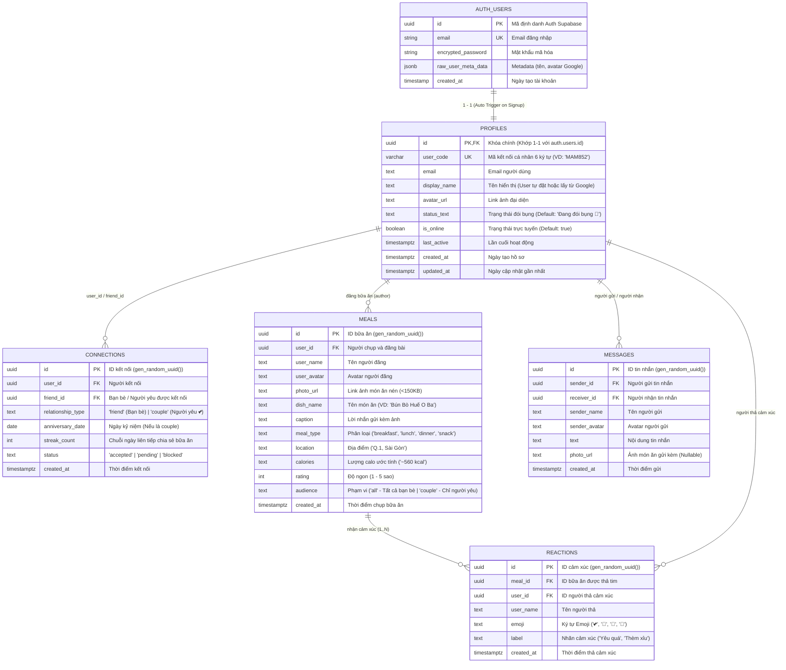

# ==============================================================================
# OURMAM - ENTITY RELATIONSHIP DIAGRAM (ERD) & DATA DICTIONARY SPECIFICATION
# ==============================================================================

Tài liệu thiết kế mô hình thực thể quan hệ (**Entity Relationship Diagram - ERD**) và từ điển dữ liệu chuẩn cho hệ thống **OurMam** (Chuẩn Locket: Kết bạn qua User Code + Chế độ Cặp đôi linh hoạt).

---

## 📊 1. Sơ Đồ Thực Thể Quan Hệ (Visual ERD)

---

## 📖 2. Từ Điển Dữ Liệu Chi Tiết (Data Dictionary)

### Bảng 1: `public.profiles` (Hồ Sơ Cá Nhân & Mã Mời)
| Tên Cột | Kiểu Dữ Liệu | Ràng Buộc | Giá Trị Mặc Định | Mô Tả |
| :--- | :--- | :--- | :--- | :--- |
| `id` | `UUID` | **PK**, **FK** -> `auth.users(id)` ON DELETE CASCADE | | Khóa chính, liên kết 1-1 với Supabase Auth |
| `user_code` | `VARCHAR(10)`| **UK**, **NOT NULL** | | Mã cá nhân chia sẻ kết nối (VD: `MAM852`) |
| `email` | `TEXT` | Nullable | `NULL` | Email đăng ký |
| `display_name` | `TEXT` | **NOT NULL** | `'Thành viên mới 🌸'` | Tên hiển thị người dùng |
| `avatar_url` | `TEXT` | Nullable | Link avatar mặc định | Ảnh đại diện |
| `status_text` | `TEXT` | Nullable | `'Đang đói bụng 🤤'` | Trạng thái ăn uống hiện tại |
| `is_online` | `BOOLEAN` | Nullable | `true` | Đang trực tuyến |
| `last_active` | `TIMESTAMPTZ`| Nullable | `NOW()` | Thời gian mở app gần nhất |
| `created_at` | `TIMESTAMPTZ`| Nullable | `NOW()` | Thời gian tạo tài khoản |
| `updated_at` | `TIMESTAMPTZ`| Nullable | `NOW()` | Thời gian cập nhật gần nhất |

---

### Bảng 2: `public.connections` (Quan Hệ Bạn Bè & Cặp Đôi)
| Tên Cột | Kiểu Dữ Liệu | Ràng Buộc | Giá Trị Mặc Định | Mô Tả |
| :--- | :--- | :--- | :--- | :--- |
| `id` | `UUID` | **PK** | `gen_random_uuid()` | Khóa chính liên kết |
| `user_id` | `UUID` | **FK** -> `profiles(id)` | | ID người kết nối |
| `friend_id` | `UUID` | **FK** -> `profiles(id)` | | ID bạn bè / người yêu |
| `relationship_type`| `TEXT` | CHECK (`friend`, `couple`) | `'friend'` | Loại quan hệ (`friend`: bạn bè, `couple`: người yêu 💕) |
| `anniversary_date`| `DATE` | Nullable | `CURRENT_DATE` | Ngày kỷ niệm tình yêu (khi là couple) |
| `streak_count` | `INT` | Nullable | `1` | Số ngày chuỗi cùng chia sẻ bữa ăn |
| `status` | `TEXT` | Nullable | `'accepted'` | Trạng thái kết nối |
| `created_at` | `TIMESTAMPTZ`| Nullable | `NOW()` | Ngày bắt đầu kết nối |

---

### Bảng 3: `public.meals` (Khoảnh Khắc Bữa Ăn)
| Tên Cột | Kiểu Dữ Liệu | Ràng Buộc | Giá Trị Mặc Định | Mô Tả |
| :--- | :--- | :--- | :--- | :--- |
| `id` | `UUID` | **PK** | `gen_random_uuid()` | Khóa chính bài đăng |
| `user_id` | `UUID` | **FK** -> `profiles(id)` ON DELETE CASCADE | | ID người chụp và đăng bài |
| `user_name` | `TEXT` | **NOT NULL** | | Tên người chụp |
| `user_avatar` | `TEXT` | Nullable | | Avatar người chụp |
| `photo_url` | `TEXT` | **NOT NULL** | | Link ảnh món ăn đã nén WebP/JPEG (< 150KB) |
| `dish_name` | `TEXT` | Nullable | `'Món ngon mỗi ngày'` | Tên món ăn |
| `caption` | `TEXT` | Nullable | | Lời nhắn kèm ảnh |
| `meal_type` | `TEXT` | CHECK (`breakfast`, `lunch`, `dinner`, `snack`) | `'lunch'` | Bữa sáng / trưa / tối / ăn vặt |
| `location` | `TEXT` | Nullable | `'Sài Gòn'` | Địa điểm quán ăn |
| `calories` | `TEXT` | Nullable | `'~500 kcal'` | Ước tính calo |
| `rating` | `INT` | CHECK (1 <= rating <= 5) | `5` | Điểm đánh giá (1-5 sao) |
| `audience` | `TEXT` | CHECK (`all`, `couple`) | `'all'` | `'all'`: Share cho tất cả bạn bè, `'couple'`: Share riêng người yêu |
| `created_at` | `TIMESTAMPTZ`| Nullable | `NOW()` | Thời gian chụp ảnh |

---

### Bảng 4: `public.reactions` (Cảm Xúc Bữa Ăn)
| Tên Cột | Kiểu Dữ Liệu | Ràng Buộc | Giá Trị Mặc Định | Mô Tả |
| :--- | :--- | :--- | :--- | :--- |
| `id` | `UUID` | **PK** | `gen_random_uuid()` | Khóa chính cảm xúc |
| `meal_id` | `UUID` | **FK** -> `meals(id)` ON DELETE CASCADE | | Bữa ăn được thả tim |
| `user_id` | `UUID` | **FK** -> `profiles(id)` ON DELETE CASCADE | | Người thả reaction |
| `user_name` | `TEXT` | **NOT NULL** | | Tên người thả |
| `emoji` | `TEXT` | **NOT NULL** | | Ký tự biểu cảm: 💕, 🤤, 👏, 🧋 |
| `label` | `TEXT` | Nullable | | Nhãn cảm xúc |
| `created_at` | `TIMESTAMPTZ`| Nullable | `NOW()` | Thời gian thả |

---

### Bảng 5: `public.messages` (Trò Chuyện & Nhắn Tin Trực Tiếp)
| Tên Cột | Kiểu Dữ Liệu | Ràng Buộc | Giá Trị Mặc Định | Mô Tả |
| :--- | :--- | :--- | :--- | :--- |
| `id` | `UUID` | **PK** | `gen_random_uuid()` | Khóa chính tin nhắn |
| `sender_id` | `UUID` | **FK** -> `profiles(id)` ON DELETE CASCADE | | ID người gửi |
| `receiver_id`| `UUID` | **FK** -> `profiles(id)` ON DELETE CASCADE | | ID người nhận |
| `sender_name`| `TEXT` | **NOT NULL** | | Tên người gửi |
| `sender_avatar`| `TEXT`| Nullable | | Avatar người gửi |
| `text` | `TEXT` | **NOT NULL** | | Nội dung tin nhắn |
| `photo_url` | `TEXT` | Nullable | `NULL` | Ảnh gửi kèm (nếu có) |
| `created_at` | `TIMESTAMPTZ`| Nullable | `NOW()` | Thời gian gửi |

---

## ⚡ 3. Các Hàm Tự Động Hóa & Thủ Tục (Triggers & Stored Procedures)

1. **`handle_new_user`**: Tự động sinh `user_code` cá nhân 6 ký tự (VD: `MAM852`) và chèn hồ sơ vào `public.profiles` khi có tài khoản mới đăng ký.
2. **`add_connection(target_code, rel_type)`**: 
   - Nhập `user_code` của người khác để kết bạn (`rel_type = 'friend'`) hoặc ghép đôi (`rel_type = 'couple'`).
   - Tự động tạo kết nối 2 chiều giữa 2 tài khoản.
